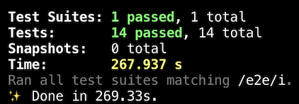

# Thank you for considering to contribute.
# Let's get going..

1. `Fork` the repository [here](https://github.com/ramgrandhi/serverless-wso2-apim/fork).

2. Create a `feature` branch and start building your feature.

3. Start docker daemon if it is not running.

4. Regression test your changes by running these commands.  

    > `yarn install`  
    > `yarn test:e2e:setup`  
    > `yarn test:e2e`  
  
    

5. Now, do not forget to add tests related to your feature by creating tests under `src/__tests__/e2e/` (follow the folder naming `valid` and `invalid` ). 

6. Run `yarn test:e2e` again. 

7. If tests are passing, you're ready to create a `merge request` into `main` branch. _Voila!_ 🚀

# Troubleshooting
If you run into issues running above scripts then you may try these steps individually.

a. Start the following docker containers separately in multiple terminals.

> `yarn install`  

> `docker run --name api-manager-260 -p 127.0.0.1:8260:8243 -p 127.0.0.1:9260:9443 --rm wso2/wso2am:2.6.0`

> `docker run --name api-manager-320 -p 127.0.0.1:8320:8243 -p 127.0.0.1:9320:9443 --rm wso2/wso2am:3.2.0`

> `docker run --name localstack -p 127.0.0.1:4566:4566 -p 127.0.0.1:4571:4571 --rm localstack/localstack`

b. Start regression tests.
    
> `yarn test:e2e`

