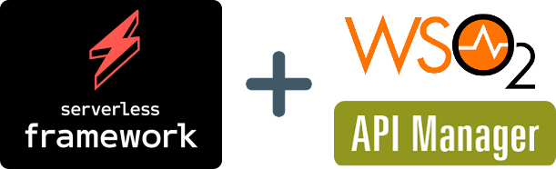

serverless-wso2-apim
====================
[](https://opensource.org/licenses/MIT)

Serverless Framework plugin to manage APIs on [WSO2 API Manager](https://wso2.com/api-management/).


---

## Compatible with
* serverlessˆ1.75
* [WSO2 API Manager 2.6.0](https://docs.wso2.com/display/AM260/)
* [WSO2 API Manager 3.2.0](https://apim.docs.wso2.com/en/3.2.0/)

## Features
* Create, Update and Publish your API definitions via `sls deploy`.  
* Manage your API definitions via `sls info` and `sls remove`.
* Supports HTTP and JMS backends with mediation policies & additional API properties.
* Uploads backend certificates (including CAs) to enable HTTP/s connectivity with backends.
* Supports Swagger 2.0 and OpenAPI 3.0 specifications.
---

## Install Plugin
* Discover it on npmjs.com @ [here](https://www.npmjs.com/package/serverless-wso2-apim)

* `yarn add -D serverless-wso2-apim`   
or   
`npm install --save serverless-wso2-apim`  

* Then in `serverless.yml` add following entry to the plugins array:
  ```yml
  plugins:
    - serverless-wso2-apim
  ```
---
## Using the Plugin

- Make sure you have a Serverless project set up as described [here](https://www.serverless.com/framework/docs/getting-started/).  

- Add configuration options to your Serverless configuration, as below.
  ```yml
  custom:
    wso2apim:
      enabled: false
      host: 'wso2-apimanager.com'
      port: 443
      versionSlug: 'v0.14'
      user: 'user@tenant'
      pass: 'pass'
      gatewayEnv: 'Production'
  ```

- Add one or more API definitions to your Serverless configuration, as below. 

  `serverless.yml:`
  ```yml
  custom:
    wso2apim:
      apidefs:
        - myAwesomeAPI: # Your API Definition Identifier
          name: 'MyAwesomeAPI'  # (CANNOT BE UPDATED LATER) Your API Name
          version: 'v1' # (CANNOT BE UPDATED LATER) Your API Version, which also forms a part of the API URL ultimately
          rootContext: '/myawesomeapi'  # (CANNOT BE UPDATED LATER) Your API Context, which will be exposed by WSO2 API Gateway. Must be unique per Gateway Environment.
          description: 'My Awesome API'
          visibility: 'PUBLIC' 
          backend: 
            http: # HTTP-based Backends
              baseUrl: 'https://backend:port/123'  
              certChain: 'file://certs/backend.cer'
          mediationPolicies: # Optional
            in: 'log_in_message'
            out: 'None'
            fault: 'None'
          apiProperties:  # Optional
            'property1': 'value1'
            'property2': 'value2'
          maxTps: 100
          tags:
            - my-awesome-api
            - awesomeness
          swaggerSpec:  # Swagger 2.0 / OpenAPI 3.0 specification in YML
  ```

- Run `sls deploy` to create-and-publish (or) update-and-republish API definitions (and associated backend certificates, if supplied) in WSO2 API Manager.


- Run `sls info` to view the status of API deployment on WSO2 API Manager.

- Run `sls remove` to delete API definitions (and associated backend certificates, if exists) when there are no active subscriptions exist on those APIs.

## Configuration Reference 

> ### **`custom.wso2apim.*`**
| Parameter     | What?         | Usage Example  |
| :------------- |:------------- | ---------------:|
| `enabled` | Default is `true`. <br> When set to `false` explicitly, deployment of APIs on WSO2 will be skipped. Suitable for offline testing etc. | `true`|
| `host` | WSO2 API Manager Hostname | `wso2-apimanager.com` |
| `port` | WSO2 API Manager Port | `443` |
| `versionSlug` | WSO2 API Manager's management API version. <br> - WSO2 API Manager `2.6.0` supports `v0.14` | `v0.14` |
| `user` | Username with an optional tenant symbol. | `user@tenant` |
| `pass` | Password, supports [Serverless Variables](https://www.serverless.com/framework/docs/providers/aws/guide/variables/) syntax.| `xxx` |
| `gatewayEnv` | Target gateway environment, as configured in your WSO2 installation. | `Production` |

<br>

> ### **`custom.wso2apim.apidefs.<Your-API>.*`**
| Parameter     | What?         | Usage Example  |
|:------------- |:-------------| ---------------:|
| `name` | (CANNOT BE UPDATED LATER) <br> Your API Name | `MyAwesomeAPI` |
| `version` | (CANNOT BE UPDATED LATER) <br> Your API Version, which also forms a part of the API URL ultimately. | `v1` |
| `rootContext` | (CANNOT BE UPDATED LATER) <br> Your API Context, which will be exposed by WSO2 API Gateway. Must be unique per Gateway Environment. | `/myawesomeapi` |
| `description` | Free-form text | `My Awesome API` |
| `visibility` |  Currently supports only `PUBLIC`. Accessible from Public Internet, Visible to everyone. | `PUBLIC` |
| `backend` | Supports `http` and `jms` backends. <br> Note: One API definition supports only one backend. |  |
| `backend.http.baseUrl` | Your HTTP backend base URL | `https://backend:port/123` |
| `backend.http.certChain` | Optional, your backend certificate chain in PEM (base64) format. <br><br> It supports: <br> a. **File system** - Path must be relative to where `serverless.yml` is located. <br> b. **AWS Certificate ARN** <br> c. **AWS CloudFormation Export** - Exported value must contain a valid AWS Certificate ARN. | `file://certs/backend.cer` <br> (or) <br> `arn:aws:acm:..` <br> (or) <br> `!ImportValue xx` <br> (or) <br> `!Ref xx` |
| `backend.jms.destination` | Your JMS Destination (queue or topic name) | `MY.BACKEND.TOPIC` |
| `backend.jms.parameters` | List of JMS connection parameters to be used in `key`:`value` form as described [here](https://axis.apache.org/axis2/java/transports/jms.html). | `transport.jms.ConnectionFactory: 'My-ConnectionFactory'`|
| `mediationPolicies` | Optional, your choice of mediation policies (or) sequences. They can manipulate input/output/fault messages as described [here](https://docs.wso2.com/display/AM260/Adding+Mediation+Extensions). | |
| `mediationPolicies.in` | Input mediation policy, it manipulates the request going to your backend. | `log_in_message` |
| `mediationPolicies.out` | Output mediation policy, it manipulates the response going back to your API consumer. | `json_validator` |
| `mediationPolicies.fault` | Fault mediation policy, it manipulates the fault handling. | `None` |
| `apiProperties` | Optional, List of API properties to be used in `key`:`value` form as described [here](https://docs.wso2.com/display/AM260/Adding+Custom+Properties+to+APIs). | `'property1': 'value1'`|
| `maxTps` | Max. Transactions per second, used for throttling. | `100` |
| `tags` | Tags as an array that show up in WSO2 console. | |
| `swaggerSpec` | Swagger 2.0 / OpenAPI 3.0 specification in YML | |

---
## 💡Tip : Organize your project files efficiently.

You can spread the configuration across multiple files, so you can manage it better. Bonus, you can use linters and validators effectively.

  **`serverless.yml:`** 
  ```yml
  custom:
    wso2apim:
      apidefs:
        - ${file('./myAwesomeAPI.yml')}
  ```

  **`myAwesomeAPI.yml:`**
  ```yml
  name: 'MyAwesomeAPI'
  version: 'v1'
  rootContext: '/myawesomeapi'
  ...
  swaggerSpec: ${file(./myAwesomeAPI.swagger.yml)}
  ```

  **`myAwesomeAPI.swagger.yml:`**
  ```yml
  openapi: 3.0.0
  info:
    contact:
      name: The Awesome Team
      email: xx@xx.com
  paths:
    /pet:
      post:
        summary: Add a new pet to the store
        responses:
          "201":
            description: Pet created
          "405":
            description: Invalid input
  ````

## What's coming up?
* For a full list of backlog items, [click here](https://github.com/ramgrandhi/serverless-wso2-apim/projects/1)

## Need Help?
* Create an issue [here](https://github.com/ramgrandhi/serverless-wso2-apim/issues) 

## License
[MIT](./LICENSE)